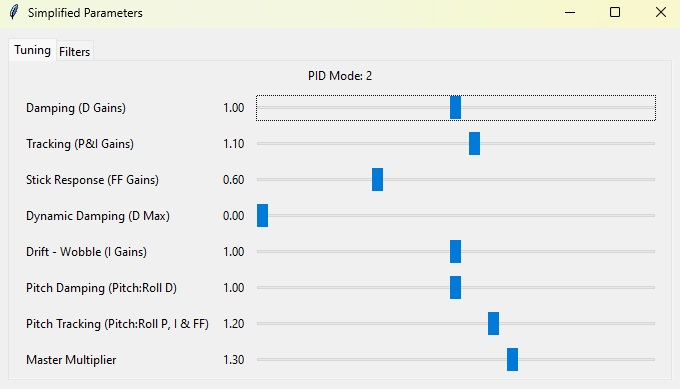

# simplified-pids-viz

Simple application for visualizing simplified PID parameters from blackbox logs.
Sliders are most likely not very accurate for values -> slider predictions in simplified mode 0.

## Usage

### From source

1. Clone this repository
2. Install dependencies: `pip install -r requirements.txt`
3. Run the application: `python src/main.py`

### Releases

Check the [releases](https://github.com/ramonsaraiva/simplified-pids-viz/releases) page for precompiled binaries.